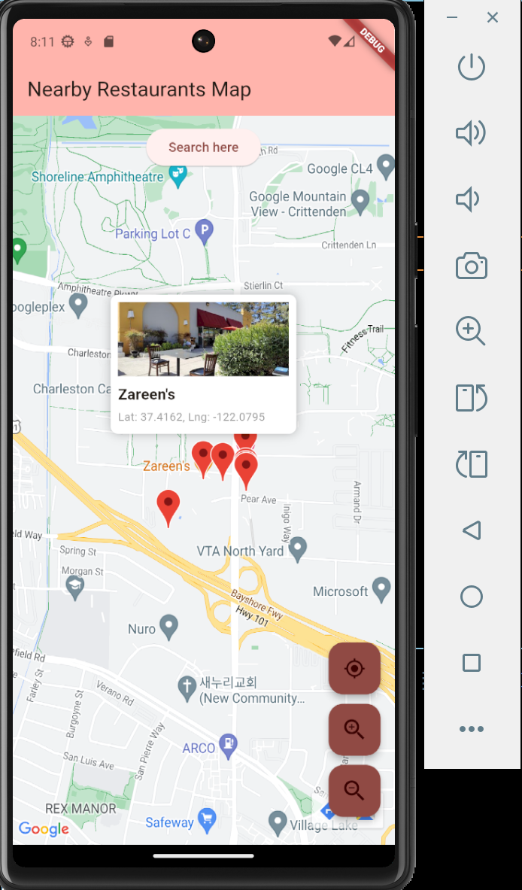

# Guidel Assignment - Nearby Restaurants Map App

This app allows users to view nearby restaurants on a map based on their current location. The map is interactive, and users can zoom in, zoom out, and search for restaurants in their vicinity. The app uses Google Maps and Google Places API to fetch and display the information about restaurants.



## Features

- **Display Nearby Restaurants**: Shows nearby restaurants based on the user's current location.
- **Interactive Map**: Zoom in/out of the map and move around to view restaurants in different areas.
- **Search Button**: Refreshes the nearby restaurants based on the current center of the map.
- **Zoom Controls**: Custom zoom-in and zoom-out buttons to control the map's zoom level.
- **Dynamic Markers**: Displays markers for restaurants that include the name, location, and image.

## Requirements

- **Flutter**: The app is built using the Flutter framework.
- **Google Maps API Key**: The app requires a Google Maps API key to access map functionality and fetch nearby places.
- **Google Places API Key**: The app uses Google Places API to fetch nearby restaurants and display them on the map.

## Installation

1. Clone the repository:
   ```bash
   git clone https://github.com/erenfn/guidel-assignment.git

2. Navigate to the project directory:

    ```bash
    cd nearby-restaurants-map
    ```

3. Install dependencies:

    ```bash
    flutter pub get
    ```

4. Add your Google Maps API key and Google Places API key to the `.env` file:

    ```makefile
    GOOGLE_MAPS_API_KEY=your_google_maps_api_key
    ```

   Make sure you have the `.env` file with the keys correctly set up for the app to work.

5. If you want to try it on iOS, change `GMSServices.provideAPIKey("YOUR_API_KEY")` in line 11 of `ios/Runner/AppDelegate.swift` to your API key.

6. Run the app:

    ```bash
    flutter run
    ```

## How it Works

1. **Initialization**: Upon starting the app, the map is centered on the user's current location. 

2. **Fetching Nearby Restaurants**: The app uses the Google Places API to fetch nearby restaurants within a 1km radius of the user's location. These restaurants are displayed as markers on the map.

3. **Zoom and Search**: The user can zoom in or out using the custom zoom buttons. When the map is moved and 'Search here' button is clicked, the app updates the list of nearby restaurants based on the new center of the map.

4. **Markers**: Each restaurant is displayed as a marker on the map. Tapping on a marker shows the restaurant's name, coordinates, and image in the info window.


### Dependencies

- `google_maps_flutter`: A Flutter plugin for displaying Google Maps.
- `http`: A package for making HTTP requests to the Google Places API.
- `flutter_dotenv`: A Flutter package for loading environment variables from a `.env` file.
- `geolocator`: A Flutter plugin for accessing the device's location services to fetch the user's current location.

